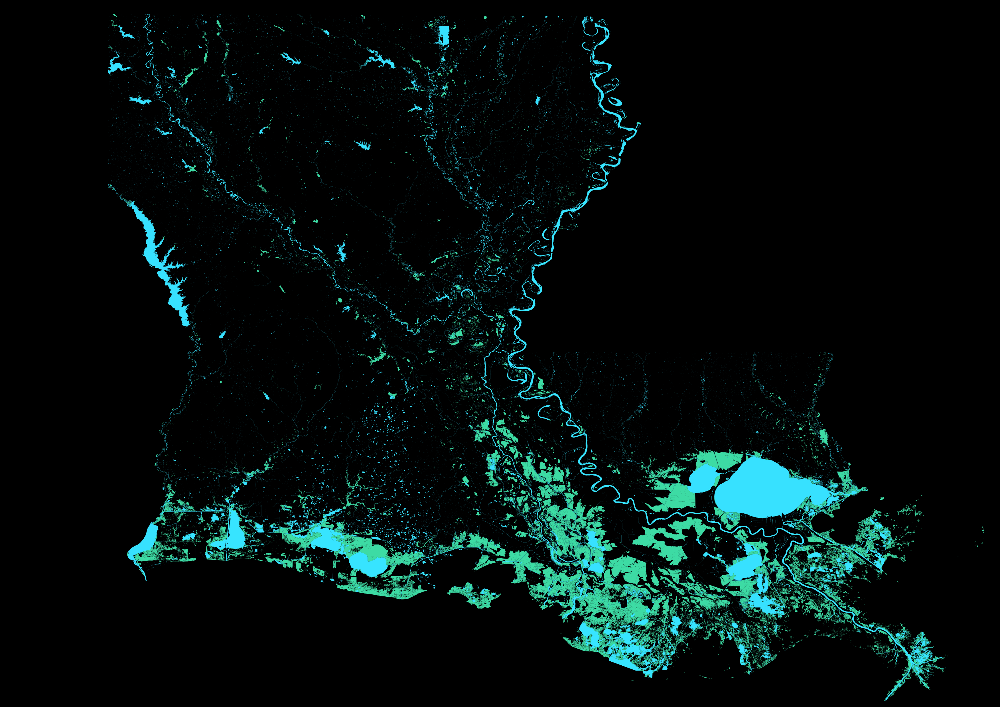

### Cajun Waterways

Southern Louisiana is  known for great cooking and a festive lifestyle. A key part of both is the  hydrological landscape that shapes the state. Following some inspiration from [Näytä Data](https://twitter.com/naytadata?lang=en), I mapped out these systems using the National Hydrogrophy Dataset [(NHD)](https://www.usgs.gov/core-science-systems/ngp/national-hydrography).

The *Blue* represents regions where rivers, lakes and streams are present. Rivers and streams are weighted by the Strahler number which measures the branch significance.  To the west of the most important Mississippi river is the Atchafalaya, Red and Black rivers which run parallel.  *Green* is representative of the swamps, bayous, and canals that form a pillar of Louisiana folklore.
