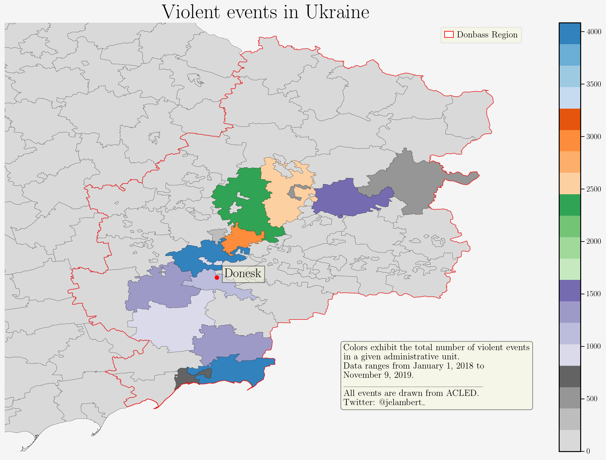

### Conflict

I was recently asked by a colleague for some help making an updated map on territorial control in Ukraine. This led me down a rabbit hole.

The conflict itself is almost entirely concentrated in the Donbass region of eastern Ukraine. Since the beginning of 2018 until November 9th, 2019, ACLED has recorded 1,267 fatalities as a result of the conflict. The data source has also recorded 55 unique actors involved. While this conflict has witnessed a series of escalating violence and brief ceasefires, territorial control has ebbed and flowed.

### Control

Measuring control at the sub-national level was the primary aim of this little project. Rather than look at Donbass as whole, I chose to assess the second administrative units from GADM. This gives a more fine-grained picture of the spatial distribution of conflict.

Data regarding violent events is drawn from ACLED.[^1] These events include battles, explosions/remote violence, and violence against civilians. The first two make up more than 99 percent of observations. I took the sum of events within each district to illustrate a map of territorial control.  This gives a fairly rough outline of where territorial control is contested. I expect a greater number of violent events correlates roughly with the degree of control one side, or the other, exhibits over a locality.

What is particularly interesting is the large number of recorded violent instances just north of Donesk and in the district of Novoazovs'kyi which borders the Sea of Azov. The far north of Donbass as well as the districts east and north of the central line of violence are largely untouched by the conflict according to ACLED's coding.

[^1]: Raleigh, Clionadh, Andrew Linke, Håvard Hegre and Joakim Karlsen. (2010). “Introducing ACLED-Armed Conflict Location and Event Data.” Journal of Peace Research 47(5) 651-660.
