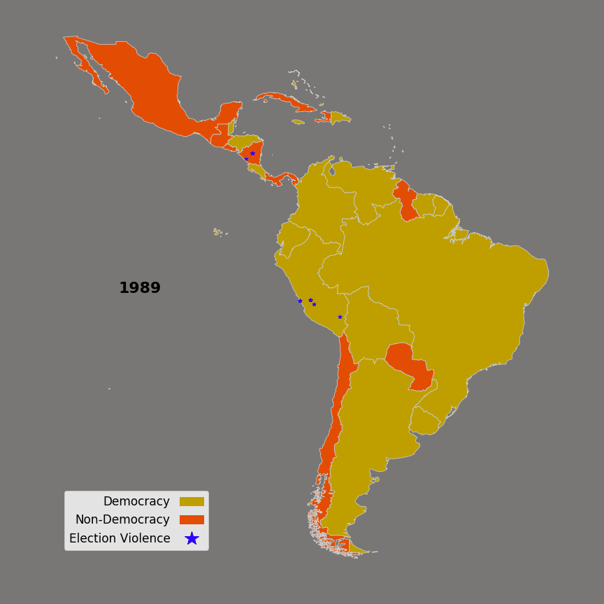

## Electoral Contention and Violence (EVAC)

A key pillar of democratic governance is elections.  This represents the time when leadership can change hands. When it does so peacefully this is a sign of a strong and stable government.  The need to understand when, where and why acts of violence occur surrounding these outcomes is of great importance.  A new dataset produced by [Daxecker, Amicarelli and Jung](https://ecavdata.org) addresses this need.

Although Latin America accounts for only 8% of all events within the EVAC data set, it is interesting to visualize the distribution of these events. Of the 1461 events that occurred in Latin America between 1989-2012, seven countries account for nearly three quarters of all events; Colombia, Haiti, Honduras, Jamaica, Mexico, Peru, and Venezuela. ~65% of all events witnessed violence.

One-fifth of all electoral violence occurred in just three country-years. Around the Haitian elections of 2000 between René Préval and Jean-Bertrand Aristide 92 events took place, of which 78% were violent with 15 participant deaths. Mexico in 2006 saw 102 electoral violence events and rampant post-election protests led by the losing candidate Obrador. Of these events less than 10% included acts of violence. And in Honduras a huge surge of events occurred on November 29th, 2009 following the events of a coup against sitting president Zelaya who sought referendum to amend his term limits in office. Of these events a slight majority were non-violent at ~52%, and 10 participant deaths during the events were recorded.
