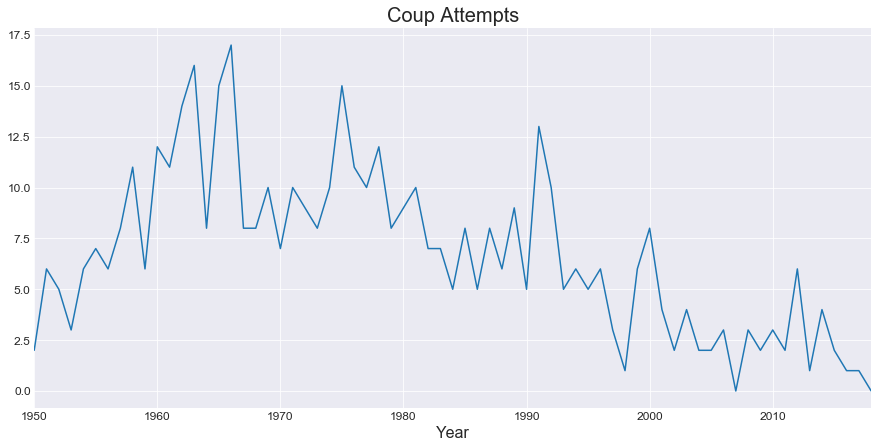
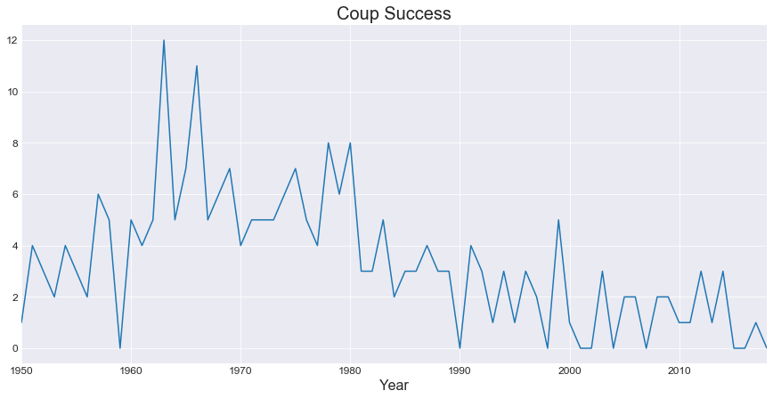
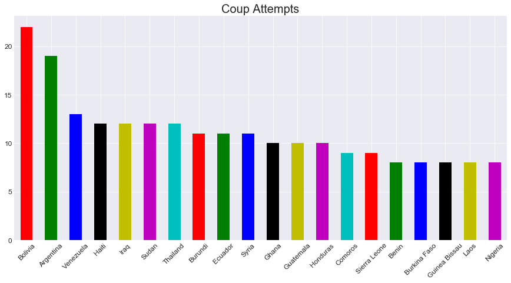
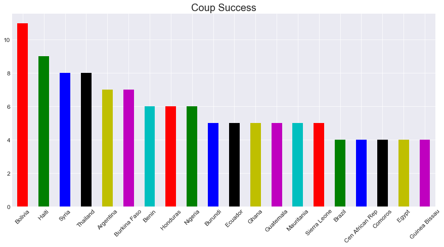

### Download

A number of data sets exist that record the political phenomenon of coup d'etat. I will review how to attain and process each of these data sets in turn before comparing them with respect to data analysis.

In this post I review the Rulers, Elections, and Irregular Governance (REIGN) data set. This data set is produced by Curtis Bell of *OneEarthFuture* foundation. It is regularly updated and maintains a country-month level of analysis. Coup attempt and coup success within a country are drawn from Jonathan Powell and Clayton Thyne's original data set [Global Instances of Coups from 1950-Present](https://journals.sagepub.com/doi/abs/10.1177/0022343310397436).

The first step is to draw this data set from its location online.  REIGN is updated monthly and to point to a static url would result in the need to update the data each time the organization uploads a new version. Instead I point to the page where the data is updated and scrape whatever data is stored.

```python
    import urllib.request as urllib2
    from bs4 import BeautifulSoup

    def get_reign(url):
    open_url = urllib2.urlopen(url)
    soup = BeautifulSoup(open_url, 'html.parser')
    p_tags = soup.findAll('p')
    href = p_tags[2].find('a')
    reign = href.attrs['href']

    return reign
```

The github page where the REIGN updates are stored has a particular location where the csv file is placed. Inspecting the page's html and finding the right tag leads to the HREF where the url for the file is stored. The code snippet above plus the url for the  [REIGN](https://oefdatascience.github.io/REIGN.github.io/menu/reign_current.html) webpage, allows for consistent up to date data downloads without having to adjust urls or code to keep up with changes. For an example of the above code and REIGN data see my github repo historial_geo_df.

### Data processing

The next step with *coup* as the target of data analysis is to conceptualize what the unit of analysis is.  REIGN has a country-month unit but these are not exclusive.  The data set is also built with elections and rulers in mind so it records transitional changes.  Therefore each transition (regular or irregular) is accompanied by a duplicate country-month row illustrating this change in leader and state characteristics. If our aim is to *predict* coups then it makes sense that we would drop the country-month duplicates that are temporally succeeding. Some of the antecedent rows are those that record a coup and so to drop these would result in losing the recorded presence of coups. To avoid this we choose to sort on the coup attempt. This can be accomplished within a pandas dataframe like so:

```python
    df = reign.sort_values('pt_attempt', ascending=False).drop_duplicates(['country', 'year', 'month']).sort_index()
```

But what about countries such as Bolivia in 1981 or Haiti in 1989 which face multiple coup attempts in a single month?  This goes back to the question of how we are trying to model the data and what outcome is important.  If the concern is how *many* coups take place then a different approach to data processing is necessary. Most often however the important feature to predict is whether *any* attempt on the executive will occur in a given temporal span (day, month, year). For this reason the above technique for de-duplicating is preferred.

Now that the data is formatted properly its possible to take a look at some descriptives. The first question is how many coup attempts and successes have occurred. The REIGN data set begins in January of 1950 and proceeds to the most updated month, which as of writing this is October 2018.  This is an unbalanced panel as some countries are not independent or have yet to come into existence in 1950. A total of **463** attempts and **233** successful coup d'etats where the executive is overthrown take place. The total country-months after dropping the duplicates is 130,0018.  This leads to a rate of success at 2/10ths of a percent in all observations and attempts occur in just ~0.36% of observations. These are very rare outcomes and predicting unique events result in a number of challenges to be discussed in later posts.

Over time the trends are interesting with large spikes for both attempts and successes in the mid-1960's.  At it's peak 17 coup attempts occured in 1966 with many recently independent African nation's struggling with stability.

[](coup_att_yr.png)
[](coup_suc_yr.png)

Nations such as Burkina Faso, Ghana, Nigeria, Central African Republic, Congo, and Burundi all experienced coups in this year. The 1960's was decade with the most successful coups followed by the 70's. Overall the trend-lines for both attempt and success is negative after this period. Beyond the patterns across time the question becomes where are these events taking place? Coups are clustered by country. In the study of this phenomenon often the most important explanatory variable is the time since a country's last coup. Exploring REIGN further we can see that coups are concentrated heavily in just a few countries.  48% of all coup attempts are found in just these 20 nations:

[](coup_att_cnt.png)

Latin America and Africa are well represented. Only three countries (Iraq, Syria, Thailand) in the top 20 are not in either of these regions. Bolivia and Argentina are particularly unique with a significant number of coups taking place, making the phenomenon far less rare in their civil-military climate. Similar to attempts a small number of countries make up a large percent of successful coups. 50% of all successes are found in these 20 nations:

[](coup_suc_cnt.png)

A lot of overlap between the two groups of 20.  One interesting absence is that of Venezuela, while third in attempts does not have a single successful coup attempt.  In contrast Syria has had 8 of their 11 coups succeed in replacing the executive.  Burkina Faso also has a high rate of success with 7 of 8 coups resulting in a change of government.
