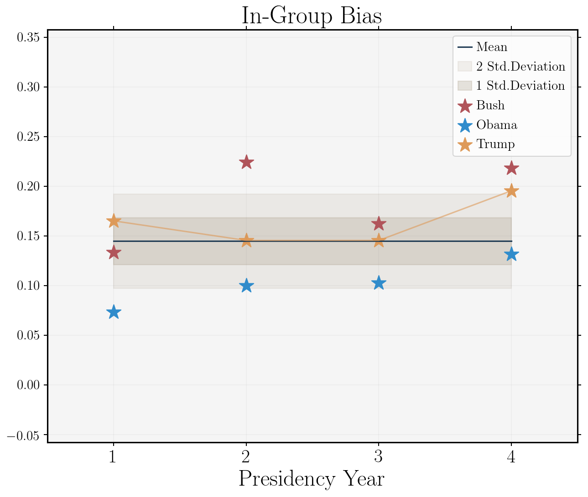

The State of the Union is an important public moment for every president since Woodrow Wilson set the precedent in 1913. These speeches generate millions of views and are often laundry lists of policy preferences and achievements.  Presidents are well aware of the public nature of these speeches and the preparation makes them primed for comparison across offices.

The use of at-a-distance psychological trait analysis creates an opportunity to assess some general SOTU trends. [Leadership Trait Analysis](https://socialscience.net/docs/LTA.pdf) has a number psychological variables that are related to personality. One such variable is the level of In-Group Bias. This measure represents the degree to which an individual shows preference towards their own group.

To illustrate this measure President Bush, Obama, and Trump are all evaluated.  Both Bush and Trump did not issue a SOTU in their first year, but did have comparable addresses to joint sessions of congress so those are used instead. Data is from the [ Psychological Characteristics of Leaders (PsyCL) data set](http://psycldataset.com).[^1]

Bush's SOTU was prone to significant in-group bias in year's 2 and 4. War ramping up in Afghanistan, and beginning in Iraq, make this not all that surprising. With Trump's most recent speech, he has broken with 95% of all US President's In-Group Bias measures.[^2]
Interpreting a score alone is not vert meaningful, however a value that is in the top 5% compared to all US president's values on the psychological characteristic is significant.

All three presidents show an increase from year 3 to year 4. This could be a function of presidents looking to sure up their within group/party support as they head into re-election.

 [^1]: “Psychological Characteristics of Leaders (PsyCL): Introducing a New Data Set" Under Review (2020) Mark Schafer and Joshua E. Lambert.

 [^2]: A note on data for mean and standard deviation.  This data is the measure of psychological values at the US president level, so scores are aggregated across all speeches within-leader.
