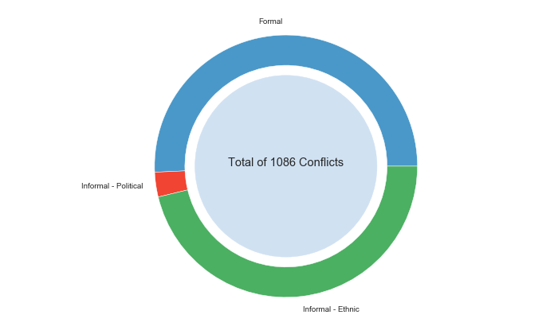
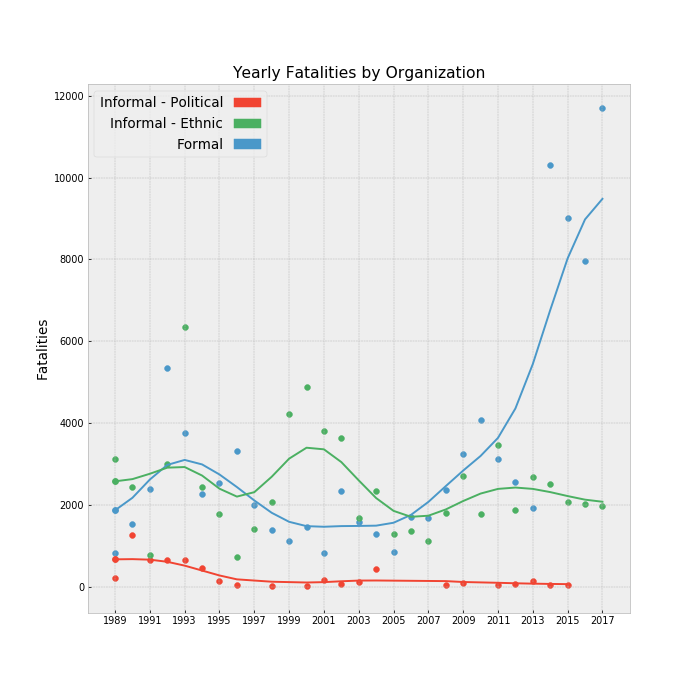

Many modern data sources are updated frequently.  Working through my dissertation and various research projects, I've become tired of having to download data to keep the pipeline of analysis up-to-date. While R has a number of libraries that do this contemporaneous data download, python libraries are less available.  I've put together a basic package that does this for a few data sources. I'll walk through how to a) install the package and b) some basic usage.

### Installation

You need to have [git](https://git-scm.com/downloads) installed on your machine. Once you have this the installation of the package is pretty basic.  I'll try to get this plugged into PyPI in the future but since I'm still actively developing the package, the github repo is simpler to maintain.

After git is installed, clone the repo for [sswebdata](https://github.com/JELambert/sswebdata). You have to navigate to wherever you downloaded it to.  Once (using terminal/command prompt) you are within the folder sswebdata/ the command is "python setup.py install". This will install the package into your package library, if you use spyder it will be in the anaconda3/lib/site-packages folder. This makes the package importable within your python script.

### Usage

This package currently contains two data sources, with more on the way! The Uppsala Conflict Data Program [(UCDP)](https://ucdp.uu.se/?id=1&id=1) and the Rulers, Elections, and Irregular Governance [(REIGN)](https://oefresearch.org/datasets/reign) dataset. The first step is to import the function(s) of interest. You can check the specific arguments within the function using help.

```python
    from sswebdata import Ucdp, Reign
    help(Ucdp)
    help(Reign)
```

At this point you have the package installed and loaded into your script. You can now utilize the function to pull data from either UCDP or Reign, both with multiple uses.

First Reign has a few options that include yearly, monthly, or the full data set.  I go over de-duplicating in a previous blog [post](http://jelambert.com/reign1/).  I also have added a few aggregated variables described further in the github repo.

I'll go over now an example of pulling the UCDP data.  Be aware that extracting this data is through the UCDP API.  This API does have some limitations like how many queries can take place, and further options so it is possible to use the code in the package to limit to your specifications before pulling the full datasets. For full API info see [here](https://ucdp.uu.se/apidocs/). The following is the code to call the non-state actor dataset:

```python
    nonstate = Ucdp.get_ucdp("nonstate")
```

This gives you a dataset with a unit of analysis of the conflict-year where the actors are both non-state groups. Within this data each unit must reach at least 25 battle-deaths within a year.

And finally just to illustrate what this particular data set has to offer here are a few descriptive plots using matplotlib. First the data has a category regarding the organizational level of the groups involved in the conflict. This is split into three distinct categories. Formal groups are htose in which the rebels are cohesive to the level of rivaling the state.  These groups are historically those that pose the only significant threat to the existing regime in an insurgency. The coding also distinguishes two types of informal groups.  These groups are broadly coinjoined along political and ethnic cleavages.  Political groups make up a far smaller portion of the non-state actors within the data set. Conversely groups that are maintained along ethnic or religious identities make up a significant ratio of total groups.

[](pie_nonstate.png)

Another important feature of this data is the estimation of total fatalities within a conflict between two non-state groups.  This measure does have a minimum of 25 yearly deaths and ranges upwards to over 10,000 deaths within a single year among non-state conflicts. While formal and informal - ethnic non - state actors have had similar total fatalities, recently formal groups have risen sharply. In 2017 conflict involving formal non-state actors resulted in nearly 12,000 fatalities.

[](scatter_nonstate.png)

###### Citations
* Sundberg, Ralph, Kristine Eck and Joakim Kreutz (2012) Introducing the UCDP Non-State Conflict Dataset, Journal of Peace Research 49(2).
* Pettersson, Therése and Kristine Eck (2018) Organized violence, 1989-2017. Journal of Peace Research 55(4).
