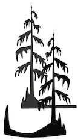

Cypress Synergy also provides solutions and mentorship regarding canine behavior. The services available are listed below.

As a free resource for dog handlers we provide the following working document:

[A Working Resource for Life with Dogs](https://docs.google.com/document/d/1NVamNDJGEBu6PUl9qpIix5whzA5TJHPh-HPjBc0Fza4/edit?usp=sharing)

If you feel inclined to contribute to this document's progress please contribute [Here](https://www.buymeacoffee.com/joshlambert).

## Services

* In-person mentorship for handler and canine
* Online consulting (including tailored video feedback)
* Extended puppy socialization and obedience training (3-4 week boarding in addition to handler mentorship)
