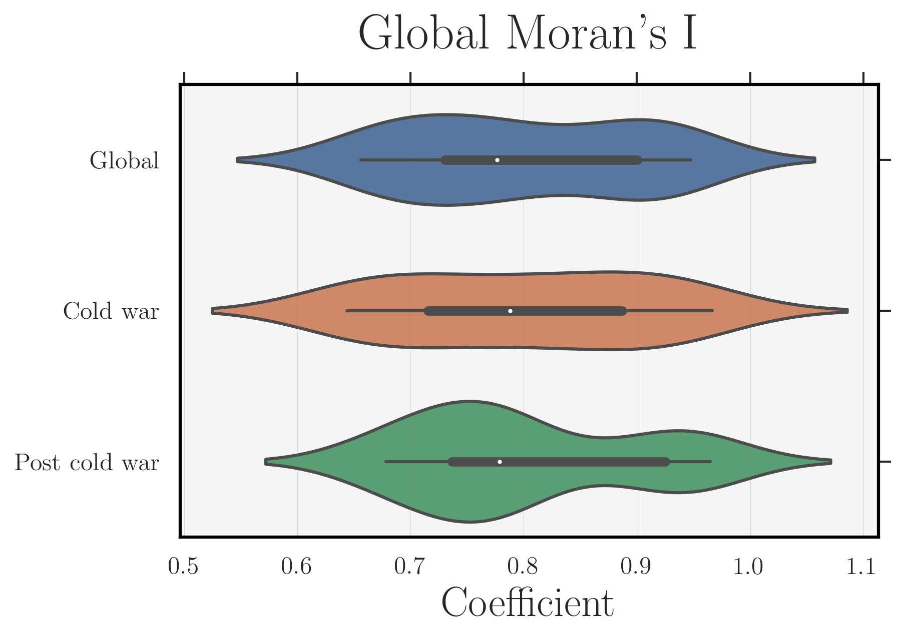
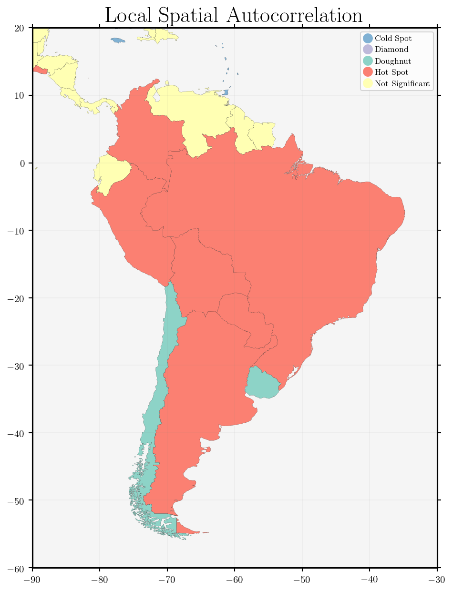
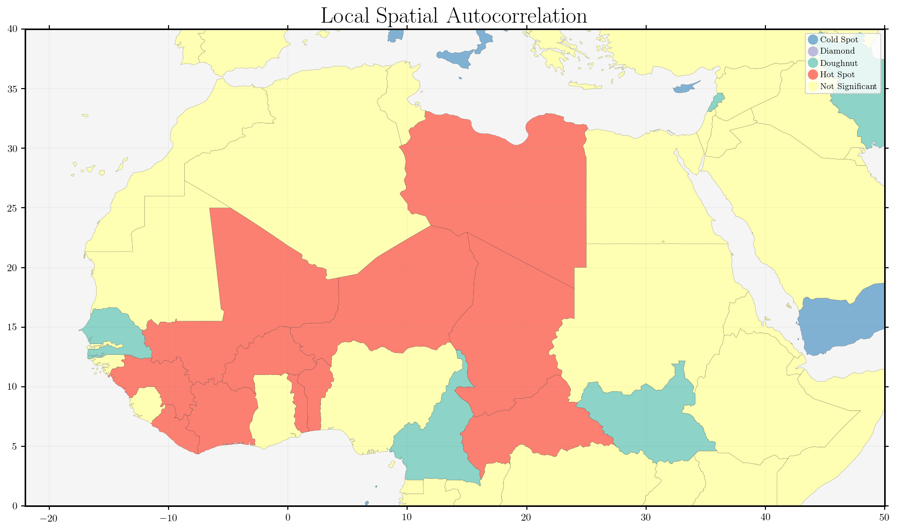
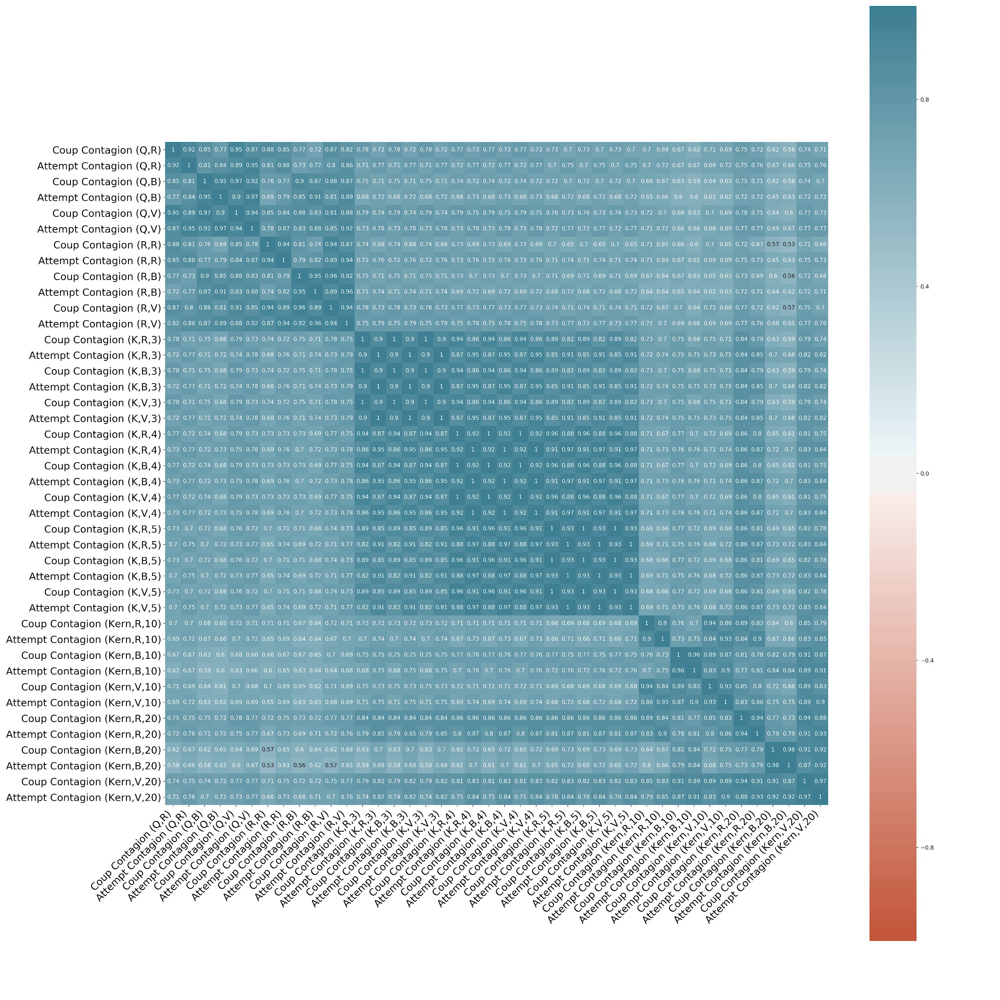

Theoretically this paper makes an important contribution to the coup contagion scholarship by conceptualizing a more plausible pathway. Whereas existing studies have focused on the temporally imminent coup outcome, I argue that putsch diffusion should focus on vulnerability. Coups exhibit diffusive characteristics through the combination of immediate shocks and historical legacy, of coups in a given neighborhood. Existing innovation diffusion literature has illustrated how spread can be mitigated or exacerbated due to characteristics of the innovation, actors involved, and environment. Drawing on this work, I utilize these characteristics to form a theoretically grounded and novel operationalization of coup contagion.

Empirically two major contributions to existing research on coup contagion are provided. First, I conduct the most robust test of coup d'état spatial autocorrelation to date. This includes using thousands of temporal and geographical aggregations and the full set of spatial weight matrix configurations with a corresponding parameter sweep. This empirical approach is strictly intended to answer the question; are coups spatially autocorrelated? Results indicate exhaustively that coups exhibit positive spatial autocorrelation. These findings lend credence to a re-examination of the coup contagion hypothesis in regression analysis.

## Basic Argument

Coups diffuse across state borders by granting greater familiarity with the behavior to potential coup plotters.

## Spatial Autocorrelation Tests

First, I test for spatial autocorrelation of coups at a variety of geographical and temporal levels, and among a robust set of potential neighborhood operationalizations. These include:
* Queen
* Rook
* Kernel (10, 20 bandwidth)
* K-Nearest Neighbor (3,4,5 neighbors)

* Row
* Binary
* Variance

At the global, cold war, and post-cold war temporal resolutions every single combination achieves statistical significance at p<.05 in the Moran's I spatial autocorrelation test.

### Local Indicators of Spatial Autocorrelation

A LISA measure is useful to identify pockets of heteroskedastic data. Two examples that show this are Sub-Saharan Africa and South America.

Tests of spatial autocorrelation lead to a re-test of the coup-contagion hypothesis. I develop a novel theoretical operationalization of coup contagion to better proxy the pathways through which familiarity of coups is witnessed.

## Testing
Again, I run all potential combinations of spatial neighborhoods. Nearly all achieve statistical significance at p<.01 in tests (KNN falls short). Models including contagion variables demonstrate better overall fit than those that do not. Logistic Regression is used to fit coup presence at the country-year level.

### Successful Coup Contagion

|                                   |     (1)          |     (2)          |     (3)          |     (4)          |     (5)          |     (6)                               |
|-----------------------------------|------------------|------------------|------------------|------------------|------------------|---------------------------------------|
|                                   |                  |                  |                  |                  |                  |                                       |
|     Coup Contagion (Kern,R,10)    |     0.395***     |                  |                  |                  |                  |                                       |
|                                   |     (0.063)      |                  |                  |                  |                  |                                       |
|     Coup Contagion (Kern,B,10)    |                  |     0.269***     |                  |                  |                  |                                       |
|                                   |                  |     (0.065)      |                  |                  |                  |                                       |
|     Coup Contagion (Kern,V,10)    |                  |                  |     0.397***     |                  |                  |                                       |
|                                   |                  |                  |     (0.064)      |                  |                  |                                       |
|     Coup Contagion (Kern,R,20)    |                  |                  |                  |     0.308***     |                  |                                       |
|                                   |                  |                  |                  |     (0.067)      |                  |                                       |
|     Coup Contagion (Kern,B,20)    |                  |                  |                  |                  |     0.154**      |                                       |
|                                   |                  |                  |                  |                  |     (0.071)      |                                       |
|     Coup Contagion (Kern,V,20)    |                  |                  |                  |                  |                  |     0.305***                          |
|                                   |                  |                  |                  |                  |                  |     (0.068)                           |
|     Time Since                    |     -0.15***     |     -0.159***    |     -0.151***    |     -0.158***    |     -0.161***    |     -0.158***                         |
|                                   |     (0.035)      |     (0.034)      |     (0.035)      |     (0.034)      |     (0.034)      |     (0.034)                           |
|     GDP pc(ln)                    |     -0.373***    |     -0.386***    |     -0.35***     |     -0.394***    |     -0.406***    |     -0.355***                         |
|                                   |     (0.081)      |     (0.082)      |     (0.082)      |     (0.081)      |     (0.083)      |     (0.082)                           |
|     Military Exp (ln)             |     -0.104**     |     -0.071       |     -0.1**       |     -0.085*      |     -0.057       |     -0.09**                           |
|                                   |     (0.045)      |     (0.045)      |     (0.045)      |     (0.045)      |     (0.046)      |     (0.045)                           |
|     Democracy                     |     -0.163       |     -0.101       |     -0.143       |     -0.123       |     -0.084       |     -0.109                            |
|                                   |     (0.162)      |     (0.161)      |     (0.162)      |     (0.161)      |     (0.161)      |     (0.161)                           |
|     Cold War                      |     0.711***     |     0.652***     |     0.694***     |     0.662***     |     0.608***     |     0.658***                          |
|                                   |     (0.15)       |     (0.149)      |     (0.149)      |     (0.148)      |     (0.15)       |     (0.148)                           |
|     Constant                      |     1.236**      |     1.256**      |     1.037        |     1.403**      |     1.389**      |     1.133*                            |
|                                   |     (0.628)      |     (0.633)      |     (0.635)      |     (0.623)      |     (0.626)      |     (0.632)                           |
|                                   |                  |                  |                  |                  |                  |                                       |
|     Observations                  |     6567.0       |     6567.0       |     6567.0       |     6567.0       |     6567.0       |     6567.0                            |
|     Pseudo R2                     |     0.162        |     0.152        |     0.162        |     0.154        |     0.147        |     0.154                             |
|     Log Likelihood                |     -993.64      |     -1004.99     |     -993.77      |     -1002.88     |     -1010.69     |     -1003.01                          |
|     AIC                           |     2005.28      |     2027.98      |     2005.54      |     2023.76      |     2039.38      |     2024.02                           |
|     BIC                           |     2066.39      |     2089.09      |     2066.65      |     2084.87      |     2100.49      |     2085.13                           |
|                                   |                  |                  |                  |                  |                  |                                       |
|     Note:                         |                  |                  |                  |                  |                  |     *p<0.1; **p<0.05; ***p<0.01       |

Positive signs indicate that as the familiarity with successful coups in a given neighborhood increases, the likelihood a state witnesses one also rises.

### Attempted Coup Contagion

|                                      |     (1)          |     (2)          |     (3)          |     (4)          |     (5)          |     (6)                     |
|--------------------------------------|------------------|------------------|------------------|------------------|------------------|-----------------------------|
|                                      |                  |                  |                  |                  |                  |                             |
|     Attempt Contagion (Kern,R,10)    |     0.527***     |                  |                  |                  |                  |                             |
|                                      |     (0.073)      |                  |                  |                  |                  |                             |
|     Attempt Contagion (Kern,B,10)    |                  |     0.27***      |                  |                  |                  |                             |
|                                      |                  |     (0.068)      |                  |                  |                  |                             |
|     Attempt Contagion (Kern,V,10)    |                  |                  |     0.472***     |                  |                  |                             |
|                                      |                  |                  |     (0.07)       |                  |                  |                             |
|     Attempt Contagion (Kern,R,20)    |                  |                  |                  |     0.358***     |                  |                             |
|                                      |                  |                  |                  |     (0.072)      |                  |                             |
|     Attempt Contagion (Kern,B,20)    |                  |                  |                  |                  |     0.148**      |                             |
|                                      |                  |                  |                  |                  |     (0.074)      |                             |
|     Attempt Contagion (Kern,V,20)    |                  |                  |                  |                  |                  |     0.317***                |
|                                      |                  |                  |                  |                  |                  |     (0.071)                 |
|     Time Since                       |     -0.151***    |     -0.16***     |     -0.154***    |     -0.159***    |     -0.161***    |     -0.159***               |
|                                      |     (0.035)      |     (0.034)      |     (0.035)      |     (0.034)      |     (0.034)      |     (0.034)                 |
|     GDP pc(ln)                       |     -0.354***    |     -0.383***    |     -0.338***    |     -0.38***     |     -0.407***    |     -0.35***                |
|                                      |     (0.081)      |     (0.082)      |     (0.082)      |     (0.081)      |     (0.083)      |     (0.082)                 |
|     Military Exp (ln)                |     -0.129***    |     -0.07        |     -0.113**     |     -0.094**     |     -0.055       |     -0.091**                |
|                                      |     (0.044)      |     (0.045)      |     (0.045)      |     (0.045)      |     (0.046)      |     (0.045)                 |
|     Democracy                        |     -0.202       |     -0.091       |     -0.135       |     -0.123       |     -0.083       |     -0.102                  |
|                                      |     (0.162)      |     (0.161)      |     (0.161)      |     (0.161)      |     (0.161)      |     (0.16)                  |
|     Cold War                         |     0.864***     |     0.685***     |     0.79***      |     0.75***      |     0.616***     |     0.705***                |
|                                      |     (0.158)      |     (0.152)      |     (0.154)      |     (0.154)      |     (0.152)      |     (0.152)                 |
|     Constant                         |     1.13*        |     1.211*       |     0.955        |     1.313**      |     1.38**       |     1.079*                  |
|                                      |     (0.629)      |     (0.633)      |     (0.637)      |     (0.622)      |     (0.628)      |     (0.633)                 |
|                                      |                  |                  |                  |                  |                  |                             |
|     Observations                     |     6567.0       |     6567.0       |     6567.0       |     6567.0       |     6567.0       |     6567.0                  |
|     Pseudo R2                        |     0.168        |     0.152        |     0.165        |     0.156        |     0.147        |     0.154                   |
|     Log Likelihood                   |     -985.89      |     -1005.36     |     -989.62      |     -1000.79     |     -1010.98     |     -1002.94                |
|     AIC                              |     1989.78      |     2028.72      |     1997.24      |     2019.59      |     2039.96      |     2023.88                 |
|     BIC                              |     2050.88      |     2089.83      |     2058.35      |     2080.7       |     2101.06      |     2084.99                 |
|                                      |                  |                  |                  |                  |                  |                             |
|     Note:                            |                  |                  |                  |                  |                  | *p<0.1; **p<0.05; ***p<0.01 |

These models indicate that even when including failed coup attempts, the familiarity with the tactic increases the prevalence of coups in a state.

## Review
Findings in the test for autocorrelation indicate that coups are positively associated in neighborhoods. This is the most robust spatial test for coup clustering. These findings lead to a renewed investigation of coup contagion.

Rather than specifying a value for contagion which is only sensitive to the presence of coups in an arbitrary temporal span, the value is a deviation from a baseline of no regional coups. By measuring coup contagion in this way, it can pick up both the year to year shocks of new regional coups, and still be sensitive to the historical context of coups in a neighborhood. This allows for a more realistic pathway for the diffusion of an innovation with such high costs.

Given the new proxy for coup familiarity, I find robust support that coups do diffuse. When a neighborhood has greater familiarity with coups as a behavior, the referent state witnesses a greater likelihood to undergo one.
