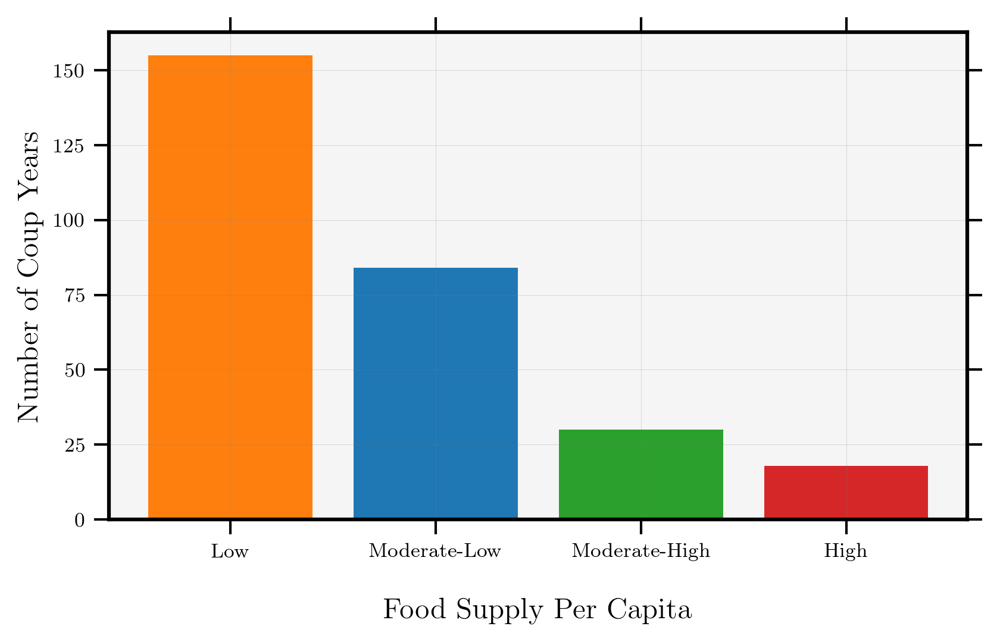
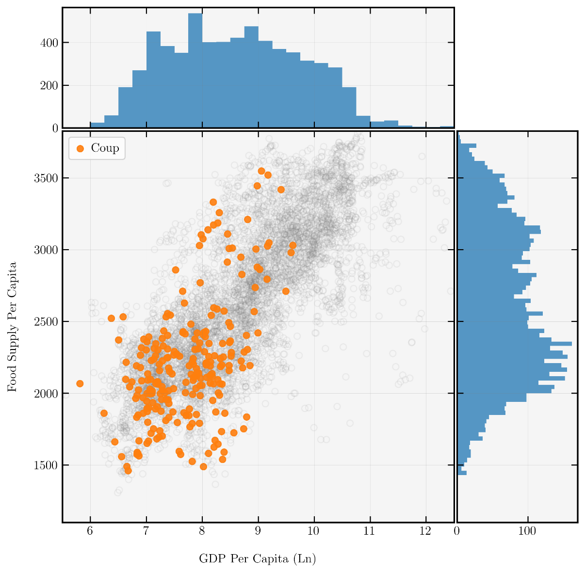
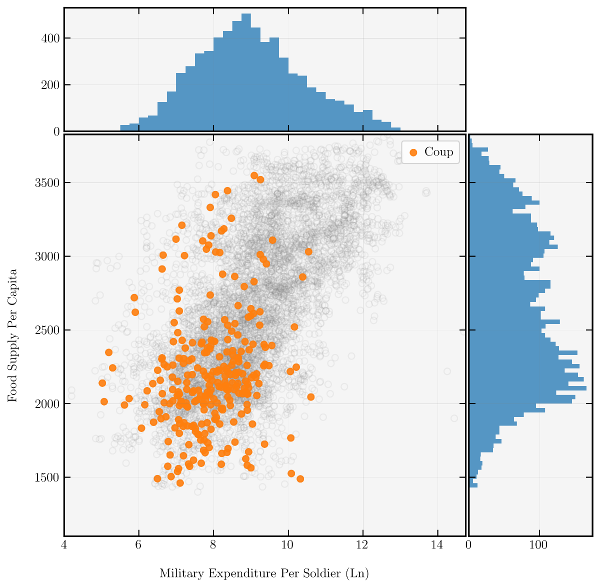
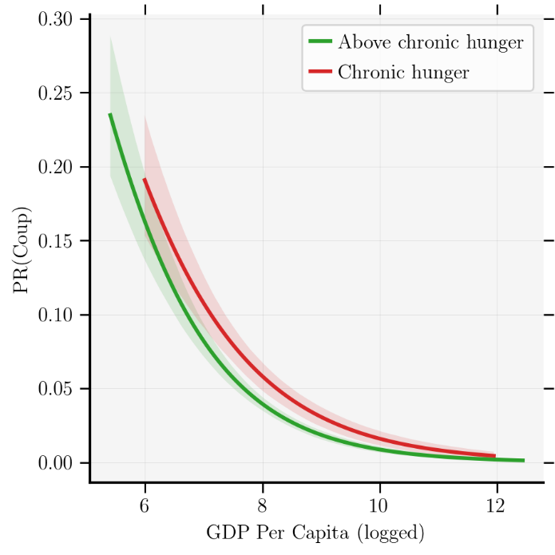
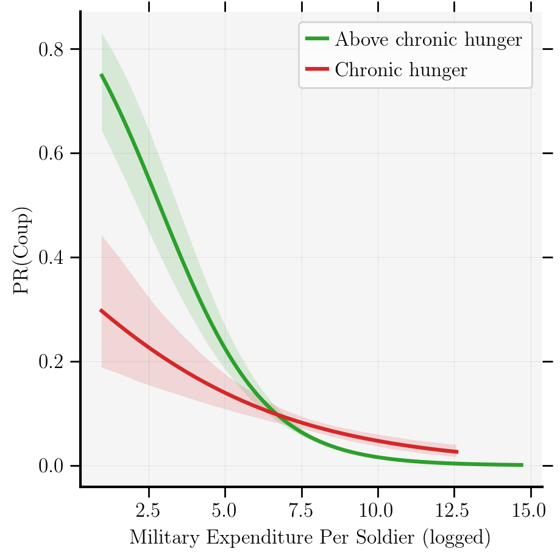

## Testing

Hunger is a ubiquitous force in the annals of political instability. It is a feeling that can lead collectives toward huge social change. Momentous ends to French (1789) and Russian (1917) monarchies were ignited by starvation. Revolutionary change is an easily identifiable form of political instability, but in the modern state system it is very rare. Of the 317 irregular leader changes identified by Archigos dataset, over 200 of those events were coups. Food insecurity is often linked to revolution and its antecedents (protest, riots, etc.), but rarely the comparatively frequent Coup d’état. Are military elites insulated from the effects of hunger? In chapter 2, I examine the relationship of food supply and prices towards coups. I draw on a theory of entitlement failure to identify why a coup plotter may alter their calculus as a result of deprivation. Results indicate that food insecurity is an important determinant for the prevalence of coups. Furthermore, the presence of chronic hunger increases the probability of a coup as development increases, relative to its absence. This relationship is extended directly to military elite by utilizing measurements for their endowments. As wealth increases, the failure to meet basic needs by the state will increase discontent. This conditional relationship increases the overall explanation of coups.

## Basic Argument

As food insecurity increases, the likelihood of a coup increases.

### Directly
An example of this occurring is the coup orchestrated by Captain Valentine Strasser and other junior officers in the Tiger and Cobra units of the Republic of Sierra Leone's Armed Forces. Food insecurity had a direct impact on the execution of this coup.

### Indirectly
Coup plotters are influenced by regime weakness, legitimacy, and impending changes to the status quo. Food insecurity influences the state along these dimensions and alters coup plotter preferences.

### Conditionality
The presence of a particular level of food insecurity, **Chronic Hunger**, will alter the probability of a coup at different levels of endowment. As *development* of the state increases, and as economic *endowment* of military members increases, the presence of **Chronic Hunger** will increase the likelihood of a coup. At low levels of development or military endowment the expectation is that coup probability will be high regardless of hunger. However, as the measures increase, the presence of chronic hunger represents a failure of the state to provide basic needs. Chronic hunger is expected to explain additional variation at moderate levels of development and military endowment.

## Testing

|                           |     (1)          |     (2)          |     (3)          |     (4)          |     (5)                             |
|---------------------------|------------------|------------------|------------------|------------------|-------------------------------------|
|                           |                  |                  |                  |                  |                                     |
|     Food Supply (cals)    |     -0.885***    |     -0.191*      |     -0.397***    |     -0.213*      |     -0.199*                         |
|                           |     (0.075)      |     (0.112)      |     (0.089)      |     (0.115)      |     (0.112)                         |
|     Time Since            |                  |     -0.166***    |     -0.206***    |     -0.171***    |     -0.166***                       |
|                           |                  |     (0.036)      |     (0.036)      |     (0.038)      |     (0.036)                         |
|     GDP pc(ln)            |                  |     -0.285***    |                  |     -0.281**     |     -0.286***                       |
|                           |                  |     (0.102)      |                  |     (0.111)      |     (0.101)                         |
|     Military Exp (ln)     |                  |                  |     -0.055       |     -0.026       |                                     |
|                           |                  |                  |     (0.044)      |     (0.054)      |                                     |
|     Democracy             |                  |     -0.001       |     -0.075       |     0.032        |                                     |
|                           |                  |     (0.173)      |     (0.161)      |     (0.181)      |                                     |
|     Cold War              |                  |     0.557***     |     0.403**      |     0.59***      |                                     |
|                           |                  |     (0.161)      |     (0.157)      |     (0.174)      |                                     |
|     Constant              |     -3.579***    |     -0.158       |     -1.735***    |     0.068        |     -29.775                         |
|                           |     (0.08)       |     (0.827)      |     (0.427)      |     (0.926)      |     (4057937.841)                   |
|                           |                  |                  |                  |                  |                                     |
|     Observations          |     7726.0       |     6400.0       |     6552.0       |     5673.0       |     6400.0                          |
|     Pseudo R2             |     0.069        |     0.144        |     0.159        |     0.155        |     0.173                           |
|     Log Likelihood        |     -1145.23     |     -890.16      |     -948.82      |     -821.4       |     -860.06                         |
|     AIC                   |     2294.46      |     1796.32      |     1913.64      |     1660.8       |     1866.12                         |
|     BIC                   |     2308.36      |     1850.43      |     1967.94      |     1720.59      |     2359.9                          |
|                           |                  |                  |                  |                  |                                     |
|     Note:                 |                  |                  |                  |                  |     *p<0.1; **p<0.05; ***p<0.01     |
|                           |                  |                  |                  |                  |     Time Since Splines not shown    |
|                           |                  |                  |                  |                  |     Fixed Effects in model 5        |

Base models with the primary proxy for food insecurity (Food Supply FAO), shows a consistent negative effect. As food supply increases the likelihood of a coup taking place decreases. Models are logistic regression and cover the time period 1961 - 2017.

### Conditional Testing

I run interactive models to test the conditional effect of chronic hunger (binary), on development and military endowments.

## Review

This paper finds robust support for both a direct link between food insecurity and coups, and a conditional effect of chronic hunger. The inclusion of food insecurity indicators increases the predictive power of coup models. Practically, policy makers need to be aware of the implications that food insecurity has on coup proclivity. Recent coups in both Niger and Sudan occurred during periods of rampant food insecurity. People in both countries were feeling the effects of famine and while international efforts to combat hunger were present, internal instability faltered. Famine has found significant attention in policy domains related to conflict and migration. This study helps to show the value of incorporating various aspects of food insecurity in models of coups.
