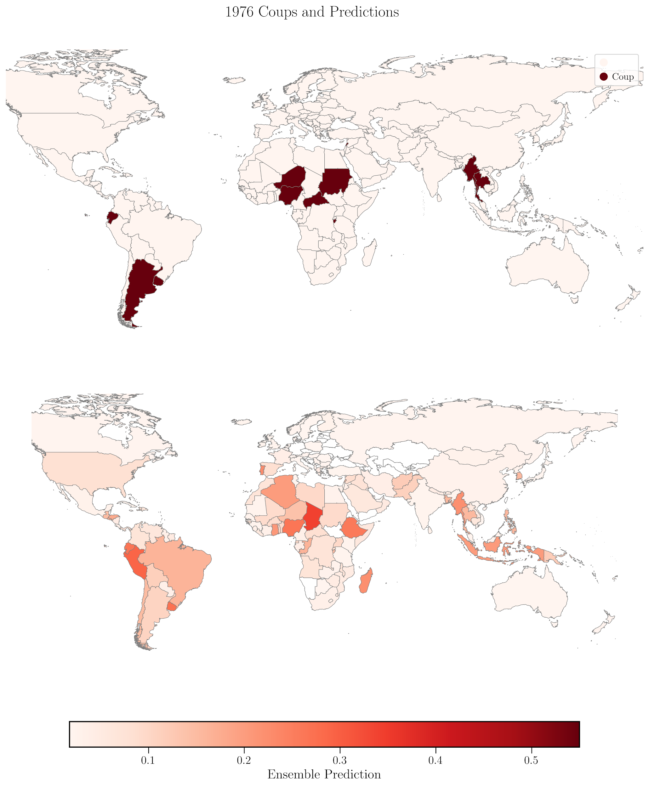
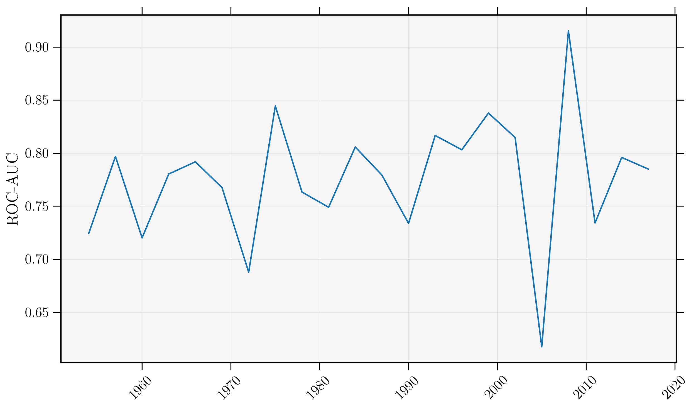
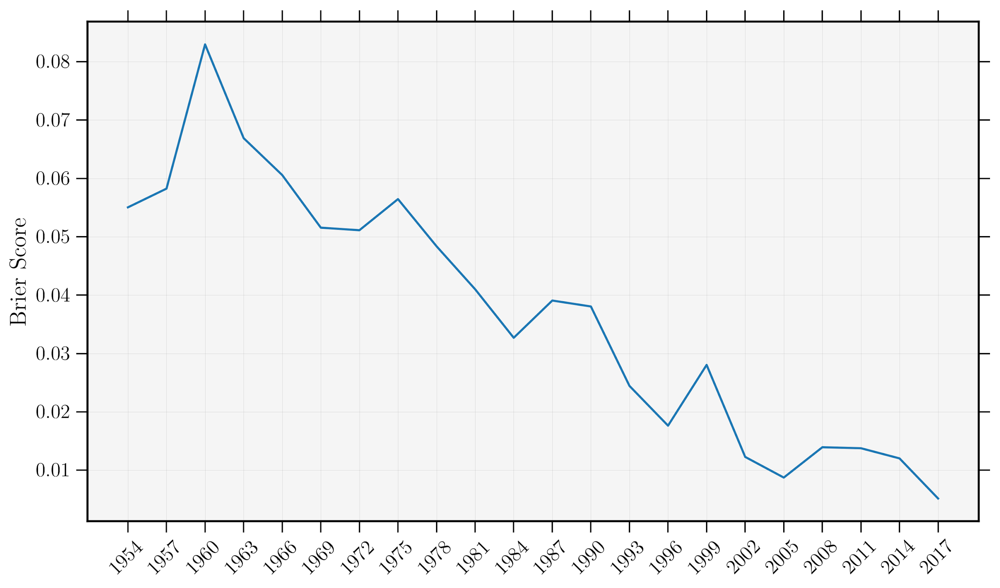
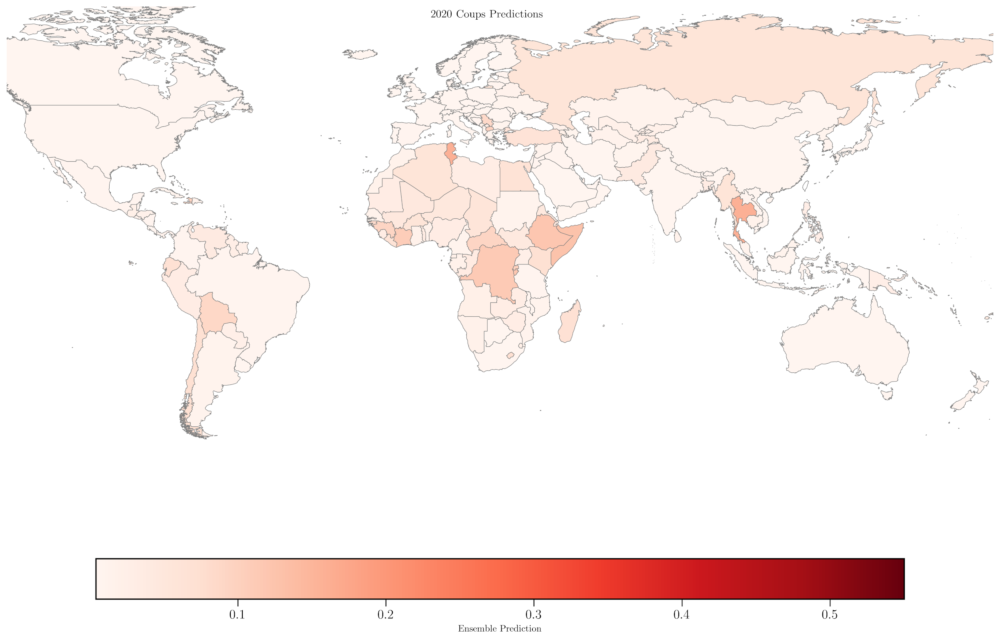
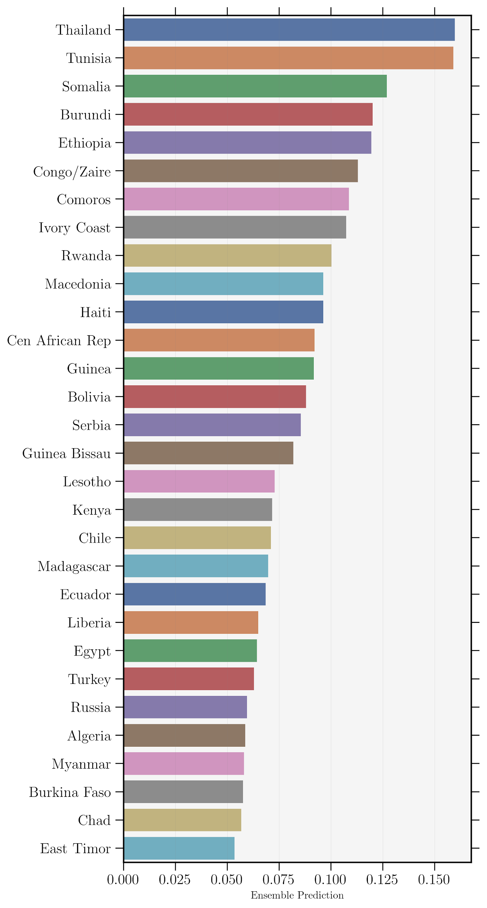

The quantitative study of coups has benefited from immense explanatory research, but less so with regard to prediction. I present a systematic framework for modeling coups utilizing a machine learning ensemble approach. Forecasts are assessed at the country level with yearly temporal resolutions. I outline a methodology that covers feature identification, processing and selection, model development and deployment, and finally metrics for assessing the predictive capacity. Forecasts indicate that in 2020 the five most likely countries for a military coup include Thailand, Tunisia, Somalia, Burundi and Ethiopia. The primary focus of this paper is to establish a baseline process, and metric, for assessing predictions regarding coups going forward.

## Focus
In contrast to the other sections of the dissertation, this chapter is focused on the use of predictive methods to maximize forecasting of coups.

# Methods
Here I will briefly outline some of the major methodological contributions.

### Feature Selection
I use a backward Sequential Feature selection to specify the best subset of potential variables. This technique starts with the full list of potential features and iteratively drops variables until the best in-sample performance is achieved.

### Rolling Origin Forecast Technique
This technique allows for:
* A more accurate leveraging of underlying temporality of the data.
* Extended comparability for future forecasting efforts.

An origin point is chosen, training and testing splits are defined around it. If the forecast period is 1970, algorithms are only trained on data from 1969 and before. This process allows for out-of-sample predictions to be defined at a number of cross-sections in time.

### 2-Step Ensemble Voting Classifier
First step classifiers include:
* KNN
* Naive Bayes
* Logistic Regression
* Random Forest
* Support Vector Machine Classifier

The second step voting classifier is a logistic regression. Each classifier is further passed a parameter grid, and sequential feature selection meaning that the ensemble can have a wide range of predictions. This increases the ability for a wisdom of the crowds approach.

### Predictions
Predictions are made as the rolling origin progresses throughout the data. An example of this is predictions made for 1976. 11 coups took place during this year and the ensemble model achieved an out-of-sample ROC-AUC score of 0.842. Three of the top five highest predicted probabilities of coups witnessed the event (Uruguay .269, Ecuador .267, Nigeria .263).

### Forecasting 2020

This papers robust methods culminate into forecasts for 2020 coup probabilities. As measures to substantiate the validity of the forecasts, I provide Brier scores and ROC-AUC over time on out-of-sample testing data.

For a geographical look at which countries are predicted to be at higher risk than others:

And the top 20 highest predicted countries include Thailand and Tunisia as the most at risk.

